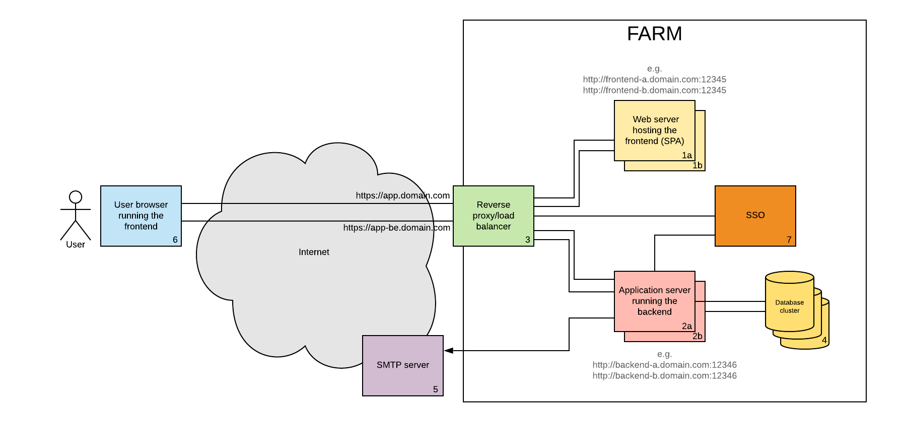

# Architettura di riferimento SPA

L'architettura è illustrata nella figura seguente.

* **1a/1b**: web server (per es. apache o nginx) che pubblicano le risorse appartenenti ai moduli di frontend, direttamente eseguibili nel browser dell'utente (plain .html, .css, .js, .ico files). I frontend sono replicati principalmente per questioni di alta affidabilità.
* **2a/2b**: application server che eseguono il backend applicativo, basati sull'ambiente di runtime utilizzato (Wildfly oppure net core). I backend espongono una API RESTful. Sono replicati principalmente per questioni di alta affidabilità e di scalabilità orizzontale. Nella configurazione di default tali application server ospitano anche i files di log applicativi (finché non sarà disponibile un log server centralizzato, in corso di predisposizione). Al fine di consentire la scalabilità orizzontale e l'aggiornamento applicativo senza interruzione del servizio, gli applicativi non devono salvare dati di sessione d'utente a bordo degli application server.
* **3**: è il componente che ha le funzioni di reverse proxy e load balancer. La strategia di load balancing non deve essere imposta, ma può essere una qualsiasi (per es. round-robin, sticky-session or hash-based).
* **4**: il database applicativo. Può essere un database relazionale o documentale (Postgres oppure MongoDB).
* **5**: il server SMTP, utile laddove l'applicativo ha bisogno di fruire dei servizi di posta elettronica.
* **6**: il browser dell'utente, tra quelli attualmente supportati.

Il browser d'utente deve poter raggiungere indifferentemente le URL di frontend e di backend, per il tramite del reverse proxy. L'applicazione deve essere servita su connessione protetta SSL.

Nell'immagine non sono rappresentati i componenti per la distribuzione automatizzata del codice sorgente (git, jenkins e relative chain di deploy).